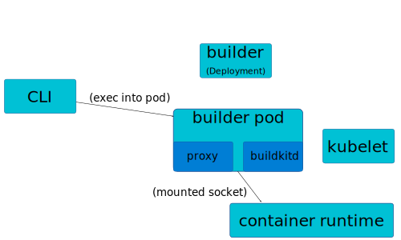

# Architecture

The following diagram shows the major components for the system.

When you run `kubectl build` or `kubectl buildkit` the kubectl CLI detects this is a CLI plugin and fork/exec's the `kubectl-buildkit` or `kubectl-build` CLI binary.

The CLI plugin then operates just like kubectl does.  It loads up your kubeconfig, uses the currently active context, and interacts with the kubernetes API on your cluster.

In order to build a container image, `kubectl build` needs one or more BuildKit builders. These builders can be created explicitly with the `kubectl buildkit create` command, or one will be created automatically the first time you run `kubectl build`. The builders are modeled as a kubernetes Deployment, but we'll probably add DaemonSet support too.

The pod spec by default tries to mount the socket for the container runtime on the host so it can communicate directly to the runtime. This works for both `containerd` and `dockerd` runtimes. This allows the builder to build and load the images you build directly into the container runtime so kubernetes can run other pods with those images. You can opt-out of this model if you prefer a de-privileged approach, but then it can't load the images directly. For those cases you will have to push any built images to a registry and then rely on the kubelet to pull them.

When you run a command like `build` the CLI finds one running/healthy pod, and does the equivalent of a `kubectl exec` to connect to the pod, then runs a small ephemeral proxy inside the container to be able to route gRPC API calls over the stdin/stdout pipe from the exec to the `buildkitd` running inside the pod.  That proxy is implemented inside the `buildkitd` CLI itself.

At present, `buildkitd` can't talk to each of the other builders directly. To make your freshly built image available in a multi-node cluster, the CLI detects multiple builder pods are running, and performs an *export* of the image from the pod that built the image. It then loads the image to the container runtimes on the other nodes using the same `kubectl exec` approach described above. It does this by talking directly to the container runtime socket inside the pod to perform loading the image.  This is typically transparent and seamless to the user, but can be noticable when building large images when using a limited bandwidth link between the CLI and the kubernetes cluster.  If you specify `--push` during the build, it skips this export/load step during the build.

## Code/Repo Layout

The following lists the major components that make up the repo

* [cmd/](../cmd/) Main routines for the CLI plugin
* [pkg/cmd/](../pkg/cmd/) Implementations of the CLI verbs dealing with argument parsing (e.g. `build`, `create`, etc.)
* [pkg/build/](../pkg/build/) The "heavy lifting" of the build logic
* [pkg/driver/kubernetes/](../pkg/driver/kubernetes/) The logic to manage and interact with the kubernetes builders
* [pkg/driver/kubernetes/execconn/](../pkg/driver/kubernetes/execconn/) The exec tunnel to send gRPC commands to the builder pod
* [pkg/driver/kubernetes/manifest/](../pkg/driver/kubernetes/manifest/) Handles creation of the kubernetes resource definitions for the builder
* [pkg/driver/kubernetes/podchooser/](../pkg/driver/kubernetes/podchooser/) Selects which pod to send build requests to
* [integration/](../integration/) Integration tests which exercise the CLI via go test running on a live kubernetes cluster
